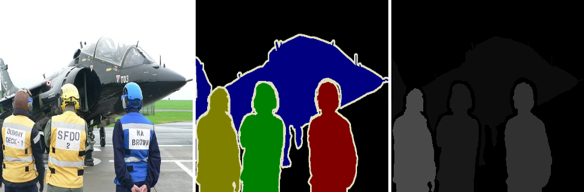
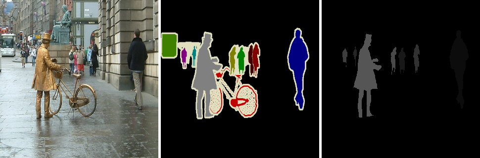
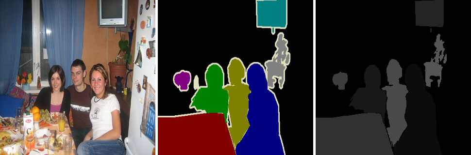
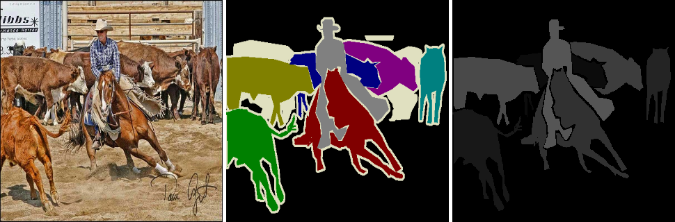

# RGB-Mask-to-Single-Channel-Mask-for-Multiclass-Segmentation
This repo contains the code for converting an RGB mask into a onehot encoded mask or a single channel grayscale mask, which can be easily used for multiclass segmentation.

Watch the complete video tutorial: [https://youtu.be/WYCvYLwIltk](https://youtu.be/WYCvYLwIltk)

# Dataset
Here we used 5 images and masks from the VOC 2012 dataset.

 
:-------------------------:
 
 

 

